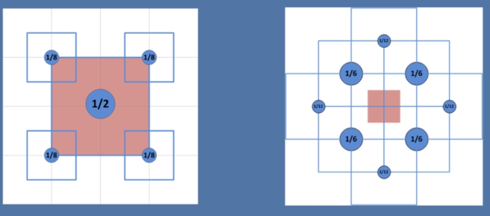

Blur效果实现与应用
===

## 一、模糊算法

模糊效果在游戏开发过程中经常会应用到。

常用模糊算法：

| 模糊算法 |  | 模糊品质 | 性能 |
| - | - | - | - |
| Gaussian Blur | 高斯模糊 | 高 | 一般 |
| Box Blur | 方框模糊 | 高 | 一般 |
| Kawase Blur | Kawase 模糊 | 高 | 较好 |
| Dual Blur | 双重模糊 | 高 | 好 | 好 | 
| Bokeh Blur | 散景模糊 | 高 | 差 |
| Tilt Shift Blur | 移轴模糊 | 高 | 差 |
| Iris Blur | 光圈模糊 | 高 | 差 |
| Grainy Blur | 粒状模糊 | 一般 | 好 |
| Radial Blur | 径向模糊 | 高 | 一般 |
| Directional Blur | 方向模糊 | 高 | 一般 |

**链接：**

[十种模糊算法的总结与实现](https://zhuanlan.zhihu.com/p/125744132)

[X-PostProcessing Libray](https://github.com/QianMo/X-PostProcessing-Library)


### 1、模糊算法的基本思想

模糊算法基本思想一般为以下几点：

1. **卷积滤波：** 通过卷积滤掉高频信息，可以采样不同卷积核达到不同滤波效果（高斯、方框、Kawase、双重）
2. **降、升采样：** 在过程中产生像素信息丢失，优化模糊效果（双重）
3. **采样偏移：** 对进行模糊的采样点偏移，从而实现指定方向的模糊（粒状、径向、方向）
4. **历史帧采样：** 保留之前帧，对历史帧与当前帧混合，达到动态模糊效果（动态）
5. **遮罩：** 在模糊的基础上，添加不同遮罩，产生不同模糊效果（移轴、光圈）

实际应用一般是基于以上思路进行组合或优化，从而达到目标效果

### 2、基础模糊算法
#### 高斯模糊
**核心思想：** 卷积是数字图像处理中，一种常用的提取图像信息的操作，在数字信号系统中，是一种滤波操作，高斯模糊就是用高斯卷积核，来提取信息，过滤高频信息的方式

**注意事项：** 高斯卷积核虽然是方形卷积核，但先做横向一排的卷积，再做纵向一排的卷积，在数学上是等价的，但是对于计算机，做一次横向+纵向卷积要比直接方向卷积要快的多，这也是为什么我们经常看到的卷积代码是分横向卷积与纵向卷积的。

#### 方框模糊
方框模糊的本质与高斯模糊无异，只是使用的卷积核不同，产生的模糊效果也有所差异


下图是两种卷积核的对比图


#### Kawase 模糊
Kawase 模糊的基本原理也是利用卷积进行模糊，与高斯和方框模糊的固定卷积核不同，该算法的卷积核随着迭代次数增肌，采样点也逐渐变远


#### 双重模糊
双重模糊则是在Kawas模糊的基础上进行改进，添加了使用不同分辨率图进行上采样与下采样的过程，并调整了卷积使用的卷积核。

双重采样的卷积核：：



双重采样的采样过程：


## 二、在URP管线下添加Blur后处理
在URP管线中添加后处理一般有两种方法：

1. RenderFeature + RenderPass
2. RenderPipelineManager + RenderPass

### 1、RenderPass 部分

``` csharp
```

## 四、利用Blur实现UI背景模糊
## 五、直接模糊Texture
## 六、UI裁剪模糊
## 七、毛玻璃模糊效果