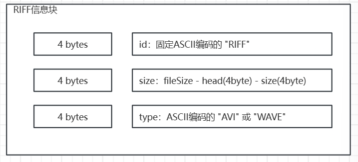
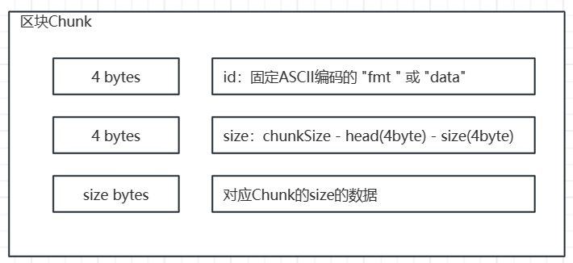
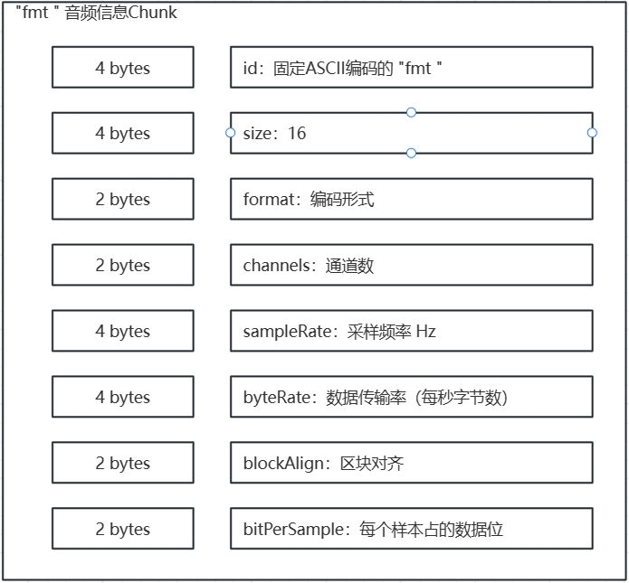
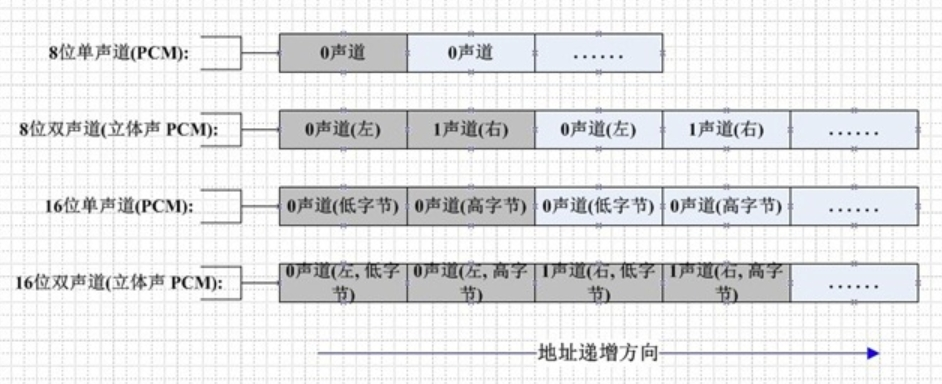

Wav文件解析
===

## 一、RIFF文件结构

要了解**wav**文件，首先要了解**RIFF**文件格式

**资源交换文件格式(Resource Interchange File Format,RIFF)** 是由Microsoft与IBM提出的一种文件格式标准。RIFF文件由头部Header + 多个Chunks 组成，如下图所示

### 1、RIFF表头(Header)
  


**对应代码：**
```csharp
/// <summary>
/// RIFF头部Chunk
/// </summary>
private class RIFFChunk
{
    public string id;       //"RIFF"
    public int size;        //size:（fileSize - id - size）
    public string type;     //"AVI" or "WAV"

    public RIFFChunk(byte[] data, int off = 0)
    {
        id      = ToASCIIString(data, off + 0);
        size    = ToInt32(data, off + 4, false);
        type    = ToASCIIString(data, off + 8);
    }
}
```

### 2、子区块(SubChunks)



**对应代码：**
``` csharp
/// <summary>
/// SubChunk
/// </summary>
private class SubChunk
{
    public string id;               //Chunk 类型
    public int size;                //Chunk 大小
    public int next;                //下一位索引

    public SubChunk(byte[] data, int off)
    {
        id = ToASCIIString(data, off + 0);
        size = ToInt32(data, off + 4, false);
        next = off + 8 + size;
    }
}
```

**注意：** 包括所有表头在内，所有Chunk的ID都是ASCII编码的4个字符（即4byte数据），并且使用的是**小端序**，要读出**Int32**的话请使用示例代码中的 **ToInt32(data, index, true)** 进行反转。

## 二、WAVE 文件的区块信息

### 1、"fmt " 区块
解析文件RIFF头部Chunk时，可以区分出WAVE文件，接着可以在数据中找到 **"fmt "** (注意这是4字节数据，包含1个字节的空格)的数据块，通过该区块来获取音频信息的采样率、通道数等信息。

fmt chunk的几个重要的信息

1. channels 声道数，一般单声道或双声道
2. sampleRate 音频采样频率，这代表这每秒有多少个音频样本
3. bitsPerSample 采样位数，这代表着每个音频数据占用的bit位，除以8就是采样字节数，占用的byte字节

$音频总时常 = \frac{(文件总字节数 - 数据起始位)}{(通道数 \times 采样字节数 \times 音频采样频率)}$



**对应代码：**
``` csharp
/// <summary>
/// "fmt " Chunk
/// </summary>
private class FormatChunk : SubChunk
{
    public short format;            //音频格式：PCM = 1
    public short channels;          //声道数
    public int sampleRate;          //采样率
    public int byteRate;            //每秒字节数
    public short blockAlign;        //区块对齐
    public short bitsPerSample;     //采样位数

    public FormatChunk(byte[] data, int off = 12) : base(data, off)
    {
        format          = ToInt16(data, off +  8, false);
        channels        = ToInt16(data, off + 10, false);
        sampleRate      = ToInt32(data, off + 12, false);
        byteRate        = ToInt32(data, off + 16, false);
        blockAlign      = ToInt16(data, off + 20, false);
        bitsPerSample   = ToInt16(data, off + 22, false);
    }
}
```
### 2、"data" 区块
data区块就是我们需要的音频数据，除了id和size，就只有data了
``` csharp
private class DataChunk : SubChunk
{
    public DataChunk(byte[] data, int off = 36) : base(data, off) { }
}

```

## 三、在Unity中转化成AudioClip
在Unity中，我们可以通过 **AudioClip.Create** 方法来自定义创建，通过**SetData**或使用**pcmreadercallback** 回调来采样数据。采样时需要注意以下几点：

1. 双声道数据左右声道是交替存放
2. 由于Unity的AudioClip已经处理了单双声道的采样，我们直接设置采样数据即可



**示例代码**
``` csharp
public void CreateAudioClip()
{
    if (riffChunk == null || formatChunk == null)
    {
        Debug.LogError("No wav data to create AudioClip");
        return;
    }

    //Creat Audio Clip
    int channels = formatChunk.channels;
    int dataByte = formatChunk.bitsPerSample / 8;
    int dataLength = (fileData.Length - dataStartIndex) / (dataByte * channels);
    int sampleRate = formatChunk.sampleRate;
    string fileName = FileName;
    audioClip = AudioClip.Create(fileName, dataLength, channels, sampleRate, false, OnAudioRead, OnAudioSetPosition);
    curPlayIndex = 0;

    //Debug
    Debug.Log(
        $"Create Audio Clip: {fileName}" +
        $"\n\tformat: {formatChunk.id}" +
        $"\n\tchannel: {formatChunk.channels}" +
        $"\n\tsampleByte: {dataByte}" +
        $"\n\tsampleRate {formatChunk.sampleRate}" +
        $"\n\ttotal: {fileData.Length}" +
        $"\n\tsample: {dataLength}" +
        $"\n\tstartIndex: {dataStartIndex}");
}

void OnAudioRead(float[] data)
{
    for(int i = 0; i < data.Length; i++)
    {
        int dataIndex = dataStartIndex + curPlayIndex * 2;//dataByte=2
        if (dataIndex < fileData.Length - 1)
        {
            data[i] = BytesToFloat01(fileData[dataIndex], fileData[dataIndex + 1]);
            curPlayIndex++;
        }
        else
        {
            data[i] = 0;
        }
    }
}

void OnAudioSetPosition(int newIndex)
{
    curPlayIndex = newIndex;
}
```

## 四、代码示例
### 1、解析区块代码

在开发过程中，发现遇到了名为JUNK的垃圾区块，这种区块没有数据，可以跳过
``` csharp
#region Data Chunk Process
public void ProcessData()
{
    //RIFF Chunk
    riffChunk = new RIFFChunk(fileData);
    if (riffChunk.id != "RIFF")
    {
        Debug.LogError("File is not RIFF file:" + riffChunk.id);
        return;
    }
    if (riffChunk.type != "WAVE")
    {
        Debug.LogError("File is not WAVE file:" + riffChunk.type);
        return;
    }

    //Read Chunks
    int index = 12;
    do
    {
        SubChunk subChunk = new SubChunk(fileData, index);
        if (subChunk.id == "JUNK")
        {
            //JUNK Chunk，Skip
        }
        if (subChunk.id == "fmt ")
        {
            formatChunk = new FormatChunk(fileData, index);
        }
        if (subChunk.id == "data")
        {
            dataChunk = new DataChunk(fileData, index);
            dataStartIndex = index + 8;
            break;
        }
        index = subChunk.next;
    } while (index < fileData.Length);
}
#endregion
```

### 2、辅助工具代码
``` csharp
#region Tools
private static float BytesToFloat01(byte first, byte second)
{
    short s = (short)((second << 8) | first);
    return s / 32768.0f;
}

public static string ToASCIIString(byte[] data, int index, int cnt = 4)
{
    return ASCIIEncoding.ASCII.GetString(data, index, cnt);
}

private static short ToInt16(byte[] data, int index, bool reverse = false)
{
    short v;
    if (reverse)
    {
        v = (short)((data[index + 1]) | (data[index]) << 8);
    }
    else
    {
        v = BitConverter.ToInt16(data, index);
    }
    return v;
}


private static int ToInt32(byte[] data, int index, bool reverse = false)
{
    int v;
    if (reverse)
    {
        v =   (data[index + 3])
            | (data[index + 2]  << 8)
            | (data[index + 1]  << 16)
            | (data[index]      << 24);
    }
    else
    {
        v = BitConverter.ToInt32(data, index);
    }
    return v;
}
#endregion

```

## 五、参考链接

[RIFF文件Wiki](https://zh.wikipedia.org/zh-cn/%E8%B3%87%E6%BA%90%E4%BA%A4%E6%8F%9B%E6%AA%94%E6%A1%88%E6%A0%BC%E5%BC%8F)

[wav、pcm数据格式](https://www.cnblogs.com/cheney23reg/archive/2010/08/08/1795067.html)

[WavForUnity github](https://github.com/DarkNest/WavForUnity.git)
