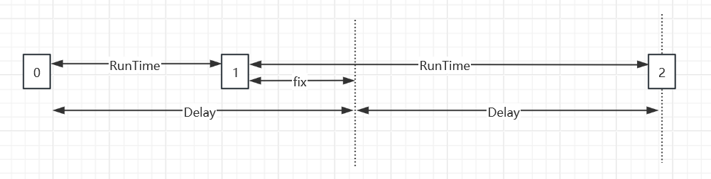
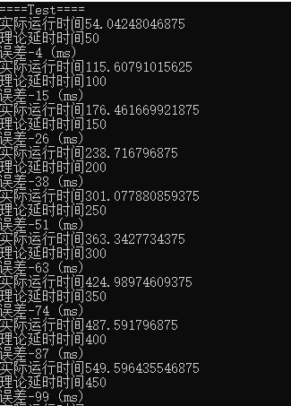
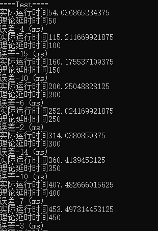

定时系统
===
## 常见Mono定时
### 1、Coroutine 定时
使用协程进行定时是Unity开发中的常用手段。

**优点：**
* 易于实现与理解
* 避免阻塞主线程

**缺点：**

* 协程需要依赖被挂载的对象的MonoBehaviour，对于服务端无法使用
* 当对象的active被设置成false时，协程会失效，即使恢复对象状态协程也不会继续运行
* 对象被销毁时，其协程资源也会被销毁
* 协程是基于帧等待机制,受帧率与Time,timesclae影响

虽然可以使用一个单独的Mono单例去管理所有协程，从而避免协程挂掉，但精度问题是无法解决的。

``` csharp
public class Timer : MonoBehaviour
{
    public float delay = 5;
    
    void Start()
    {
        StartCoroutine(DelayTime(delay));
    }

    IEnumerator DelayTime(float time)
    {
        Debug.Log($"等待延时{time}s");
        yield return new WaitForSeconds(time);
        Debug.Log("延时结束");
    }
}
```

### 2、Update 定时
**优点：**
* 易于实现

**缺点：**
* 需要很多中间变量维护定时器，使得代码结构更混乱，更难理解与维护
* 依赖被挂载的对象的MonoBehaviour，对于服务端无法使用
* 协程是基于帧等待机制,受帧率与Time,timesclae影响

``` csharp
public class Timer : MonoBehaviour
{
    public float delay = 5;
    private float timer = 0;
    private bool isEnd = false;

    private void Update()
    {
        timer += Time.deltaTime;
        if(timer >= delay && !isEnd)
        {
            Debug.Log("延时结束");
            isEnd = true;
        }
    }
}
```

## 定时器设计

### 1、定时器驱动
定时器的设计按照驱动方式，有三种设计方式：

* 外部驱动：提供外部更新接口，在定时器外部检测定时任务。
这种方式可以外接自定义的驱动程序（例如MonoBehavior中用Update），定时精度取决于驱动程序。

* 单线程Tick驱动：创建一个新的线程，在线程中以固定频率检测定时任务。
该方式所有定时任务都在一个独立线程中中执行，如果存在很耗时的任务，可能会阻塞该线程，影响到其他定时任务。

* 多线程驱动：为每个任务创建一个线程，每个线程单独执行该定时任务。
每个任务都有独立的线程，任务之间互不干扰，但如果定时任务过多，会占用大量线程资源。

### 2、延时补偿
一般在定时器执行延时操作时，都会存在一定的误差，当定时器长期运行后，这种误差会逐渐增大。
这种时候，我们可以通过添加延时补偿来修正定时效果，从而减小累计延时误差。

延时补偿的原理如下图所示


定时器在一轮定时任务中，实际延时RunTime，与期望的Delay存在误差（fix），我们可以计算该误差，
并在下一轮延时中，添加上该误差值，从而使得每轮定时任务可以尽可能在期望时间点执行。

以下代码为延时补偿的代码（多线程异步）
``` csharp
CancellationTokenSource cancelTokenSource = new CancellationTokenSource();
CancellationToken cancelToken = cancelTokenSource.Token;
Task timerTask = new Task(async () => {                
    long loopCnt = 0;
    int nextStepTime = stepTime;
    double startTime = TimerTool.GetCurMillisecond();
    while (true)
    {
        //延时
        await Task.Delay(nextStepTime, cancelToken).ContinueWith(tsk => { });

        //退出线程
        if (cancelTokenSource.IsCancellationRequested)
            return;

        //延时补偿
        loopCnt++;
        double curTime = TimerTool.GetCurMillisecond();
        double totalRunTime = curTime - startTime;
        double totalStepTime = loopCnt * stepTime;
        double fixTime = totalStepTime - totalRunTime;
        nextStepTime = stepTime + (int)fixTime;
        nextStepTime = Math.Max(nextStepTime, 1);

        //更新定时任务
        UpdateTimerTask();
    }
});
timerTask.Start();
```

下图为使用固定延时（延时50ms），定时器循环累计定时的误差，可以看到该误差值随着时间越来越大


下图为添加了延时补偿的定时器（延时50ms），可以看到每次调用的误差值基本在可控范围


### 3、其他
[定时器项目Github](https://github.com/DarkNest/GWTimer/tree/main)
