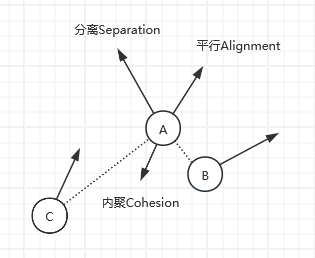
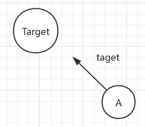
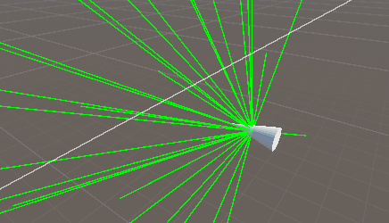



Boids算法实践
===

[[toc]]

## 算法原理

### 一、基本原理
Boids算法是一种群体模拟算法，常用于群体行为模拟。算法的核心包含三个基本行为：

1. **分离(Separation)**：检测周围个体，基于周围个体的位置，产生一个远离周围个体的力（速度或加速度）
2. **平行(Alignment)**：检测周围个体，基于周围个体速度的平均值，产生一个平行力（速度或加速度）
3. **内聚(Cohesion)**：检测周围个体，基于周围个体的质心，产生一个向质心的力（速度或加速度）



Boids算法就是基于以上三点产生的力，通过加权求和，得到个体最终的运动结果

### 二、扩展
在实际开发过程中，我们可以添加其他影响因素，来改变集体行为。

#### **1、指向target的力**
给群体指定一个target，每个个体产生一个朝向target的力（速度或加速度），通过加权求和，可以让Boids群体朝向target移动



#### **2、避障检测**
通过个体超周围方向进行射线检测，当检测到障碍物时，产生一个没有障碍物方向上的力，可以实现个体的环境避障



## 代码实践
### 一、分离、平行、内聚 的加速度计算
``` csharp
private Vector3 CalcuBoidAcceleration()
{
    List<Boid> boids = group.boids;
    Vector3 acc = Vector3.zero;

    sepAcc = Vector3.zero;  //分离加速度
    aliAcc = Vector3.zero;  //平行加速度
    cohAcc = Vector3.zero;  //内聚加速度
    perceptNum = 0;

    foreach (Boid boid in boids)
    {
        if (boid == this)
            continue;
                    
        Vector3 delta = boid.transform.position - transform.position;
        float dis = delta.magnitude;

        //只处理在检测范围内的对象
        if (dis < setting.perceptionRadius)
        {
            perceptNum++;
            cohAcc += delta;
            //Alignment加速度（基于其他对象的运动方向）
            aliAcc += boid.transform.forward;
            //Separation加速度（基于其他对象的距离）
            if (dis < setting.avoidanceRadius)
                sepAcc -= delta.normalized / dis;
        }
    }
        
    if (perceptNum != 0)
    {
        //Cohesion加速度（基于其他对象的质心位置）
        cohAcc = cohAcc / perceptNum;
        acc = SteerTowards(aliAcc) * setting.alignmentWeight + 
                SteerTowards(sepAcc) * setting.separatonWeight +
                SteerTowards(cohAcc) * setting.cohesionWeight;
    }
        
    return acc;
}
```
### 二、朝向指定目标
``` csharp
private Vector3 CalcuTargetAcceleration()
{
    Vector3 acc = Vector3.zero;
    if (target != null)
    {
        //朝向目标点加速度
        Vector3 tarAcc = target.position - transform.position;
        acc = SteerTowards(tarAcc) * setting.targetWeight;
    }
    return acc;
}
```
### 三、环境检测
``` csharp
private Vector3 CalcuCollisionAcceleration()
{
    Vector3 acc = Vector3.zero;
    RaycastHit hitInfo;

    //射线检测正前方，出现阻挡物时，进行后续检测
    bool ishit = Physics.SphereCast(transform.position,
        setting.collisionRadius,
        transform.forward,
        out hitInfo,
        setting.collisionDistance,
        setting.collisionMask);
    if (!ishit)
        return acc;

    //获取需要检测的射线方向（Local坐标）
    Vector3[] detectDir = group.GetDetectDirs();
    for(int i = 0; i < detectDir.Length; i++)
    {
        Vector3 dir = detectDir[i];
        //将射线转化到世界坐标
        dir = transform.TransformDirection(dir);            
        ishit = Physics.SphereCast(transform.position,
            setting.collisionRadius,
            dir,
            out hitInfo,
            setting.collisionDistance,
            setting.collisionMask);
        if (ishit)
            continue;
        //朝向没有碰撞的方向加速
        acc = dir;
        break;
    }
    acc = SteerTowards(acc) * setting.collisionWeight;
    return acc;
}
```
射线检测方向的获取可以参考均[匀球面离散点生成](https://people.engr.tamu.edu/schaefer/research/normalCompression.pdf)
``` csharp
public Vector3[] GetDetectDirs()
{
    if (detectDir == null)
    {
        int numDirs = setting.detectNum;
        //均匀球面离散点生成
        //参考文章:https://people.engr.tamu.edu/schaefer/research/normalCompression.pdf
        detectDir = new Vector3[numDirs];
        float range = Mathf.Cos(setting.collisionAngle * Mathf.PI / 360);
        float goldenRatio = (1 + Mathf.Sqrt(5)) / 2;
        float angleIncrement = Mathf.PI * 2 * goldenRatio;
        for (int i = 0; i < numDirs; i++)
        {
            Vector3 p = Vector3.zero;
            float t = (float)i / numDirs;

            //扇形区域
            float ac = 1 - (1 - range) * t;
            //球形区域
            //float ac = 1 - 2 * t;

            //计算射线方向
            float alpha = Mathf.Acos(ac);
            float beta = angleIncrement * i;
            p.x = Mathf.Sin(alpha) * Mathf.Cos(beta);
            p.y = Mathf.Sin(alpha) * Mathf.Sin(beta);
            p.z = Mathf.Cos(alpha);
            detectDir[i] = p;
        }
    }

    return detectDir;
}
```
上述代码中使用到了一个因子：goldenRatio = (1 + Mathf.Sqrt(5)) / 2; 

这个因子可以使生成的射线更均匀的分布在球表面，以下是该因子从0开始逐渐增加时，射线产生的变化：


## 测试优化
该项目的优化可以考虑使用以下方式优化：
* 四叉树存储对象，可以一定程度上减少Update中遍历boids列表的数量
* ComputeShader，将boids分离、平行、内聚的加速度运算改到ComputeShader运算，减少for遍历带来的损耗
* Dots，使用dots系统可以很好的优化大量群体对象运算

下图展示了使用ComputeShader优化后的性能表现


## 参考
[项目Github链接](https://github.com/DarkNest/Boids)

[youtube视频](https://www.youtube.com/watch?v=bqtqltqcQhw)

推荐书籍：《基于物理的建模与动画》