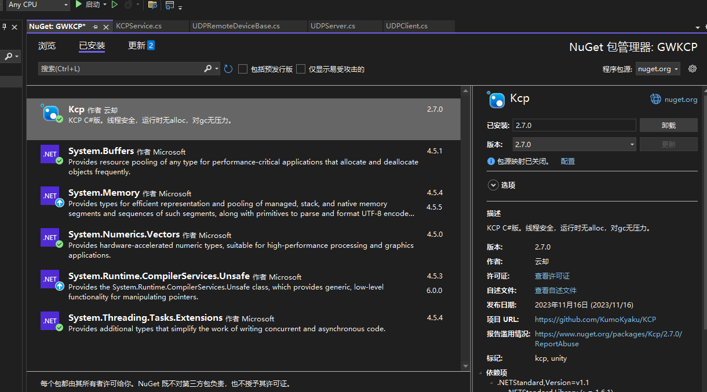
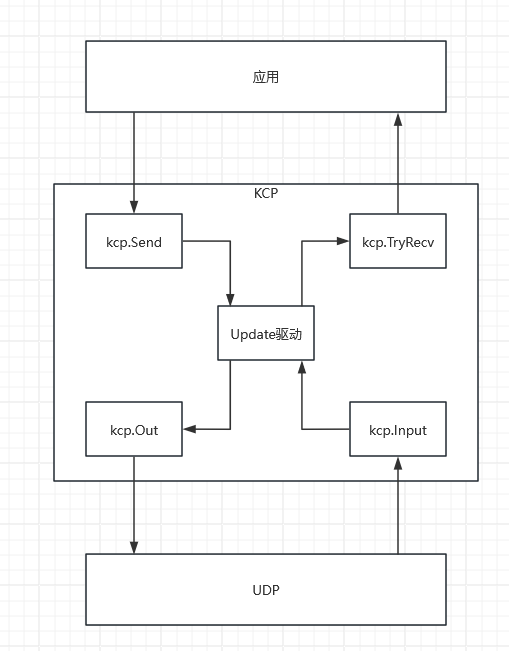

基于KCP的网络通讯
===

## 一、简介
### 1、介绍
**KCP（快速可靠协议）** 是一种高效、可靠的传输层协议。

与传统的TCP协议相比，在网络条件较差的环境下表现出更高的数据包传输效率和更低的延迟。

KCP的设计目标是实现快速、低延迟的数据传输，旨在解决网络拥堵下TCP传输速度慢的问题的协议，

它在可靠性和传输速度之间取得了良好的平衡。

### 2、原理
* 基于UDP的可靠传输：

      KCP 是基于 UDP 的协议，它通过牺牲一些传输可靠性来换取更低的延迟和更高的传输速度。

      KCP 的设计目的是解决在网络拥堵的情况下，TCP 协议传输速度变慢的问题。

* 数据包分片和控制头：

      KCP 将要发送的数据分片成 KCP 数据包格式，并插入待发送队列中。

      KCP 在 UDP 数据报文的基础上增加了控制头，用于管理数据包的传输。

* 超时与重传：

      KCP 通过超时重传机制来保证数据传输的可靠性。

      如果发送的数据包在一定时间内没有收到相应的 ACK，KCP 会重新发送该数据包。

* 滑动窗口机制：

      为了提高传输速度，KCP 使用滑动窗口机制。

      发送方不必在每发送一个包之后就等待确认，而是可以发送多个包出去，然后等待接收方一一确认。

* 快速重传机制：

      KCP 可以设置快速重传机制，当重复的 ACK 数量达到一定阈值时，直接进行重传。

      这有助于在丢包的情况下快速恢复数据传输。

## 二、实现
这里使用的kcp协议包如图所示

驱动原理

### 1、客户端实现
### 2、服务端实现
