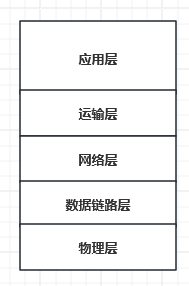

计算机网络基础
===

## 一、五层协议模型

* **应用层：** 直接为应用进程提供服务：HTTP（浏览器）、SMTP（邮件）、FTP（文件传输）
* **运输层：** 运输应用层的数据，主要为两种协议：

      TCP：传输控制协议（Transmission Control Protocol）
      面向连接，以报文段（segment）为传输单位，保证传输可靠性

      UDP：用户数据报协议（User Datapram Protocal）
      无连接，以用户数据包为传输单位，不保证传输可靠性

* **网络层：** 

      负责在不同主机之间传输数据包。

      定义了逻辑地址（例如IP地址）以标识所有节点，并规定了路由的实现方式。

      网络层还处理数据包的分段，以适应不同传输介质的最大传输单元长度。

      协议：IP（Internet Protocol）、IPX等。

      数据单位：数据包（packet）。

* **数据链路层：**

      负责在单个链路上传输数据。

      它定义了如何在物理链路上传输数据，与具体的传输介质有关。

      数据链路层将数据封装成帧，并处理帧的传输、错误检测和纠正。

      协议：Ethernet、FDDI等。

      数据单位：帧（frame）。

* **物理层：** 实际的物理连接，比特流数据传输

## 二、常用基于UDP的网络库
* **ENet：**
      
      简单而强大的可靠UDP网络库。
      
      专门用于实时多人游戏，基于UDP。
      
      提供了面向连接的协议、可靠性、流式传输和部分可靠的数据报传输12.

* **RakNet：**
      
      基于UDP网络传输协议的C++网络库。
      
      用于游戏中实现高效的网络传输服务。
      
      特点包括高性能、易用性、跨平台支持、安全传输、音频传输等13.

* **KCP：**
      
      快速可靠协议，能以比TCP浪费10%-20%的带宽的代价，换取平均延迟降低30%-40%，且最大延迟降低三倍的传输效果。
      
      纯算法实现，需要自定义底层数据包的发送方式。
      
      适用于P2P、基于UDP的协议等场景14.